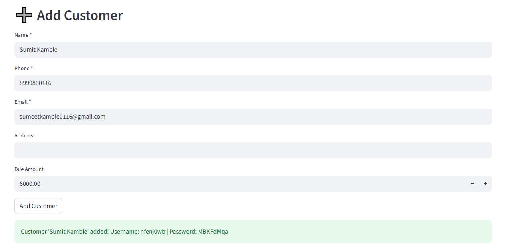
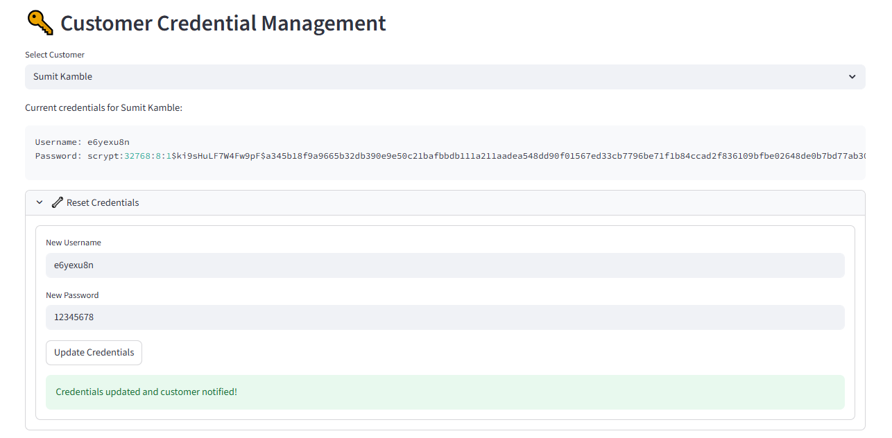
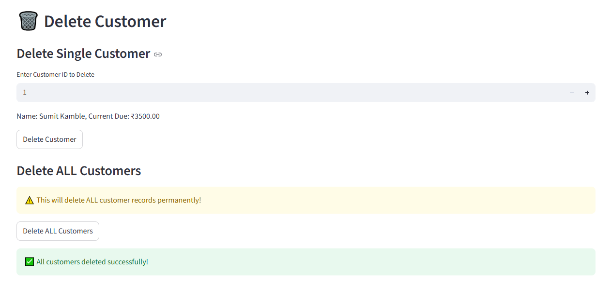
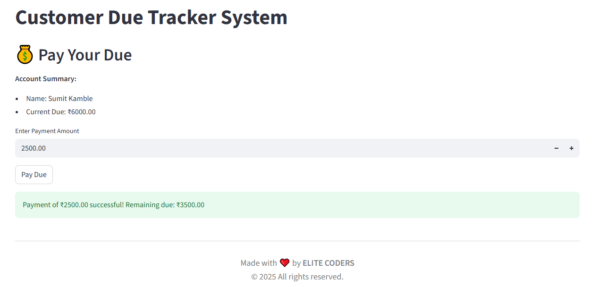
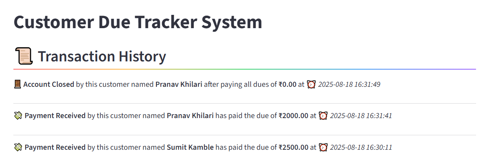
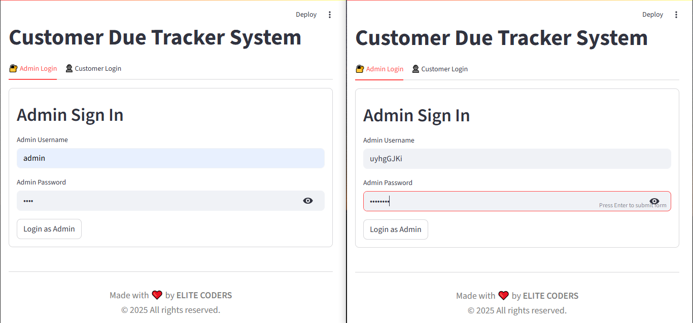
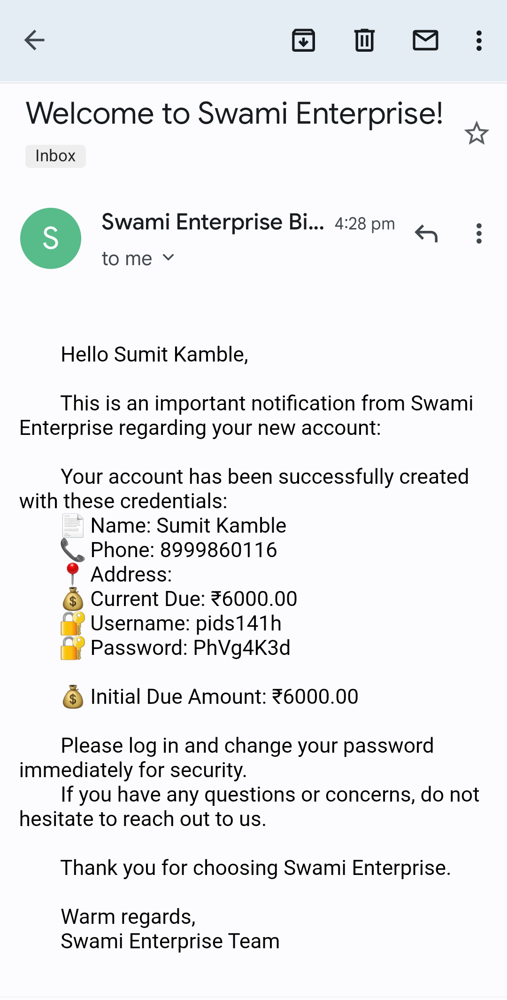
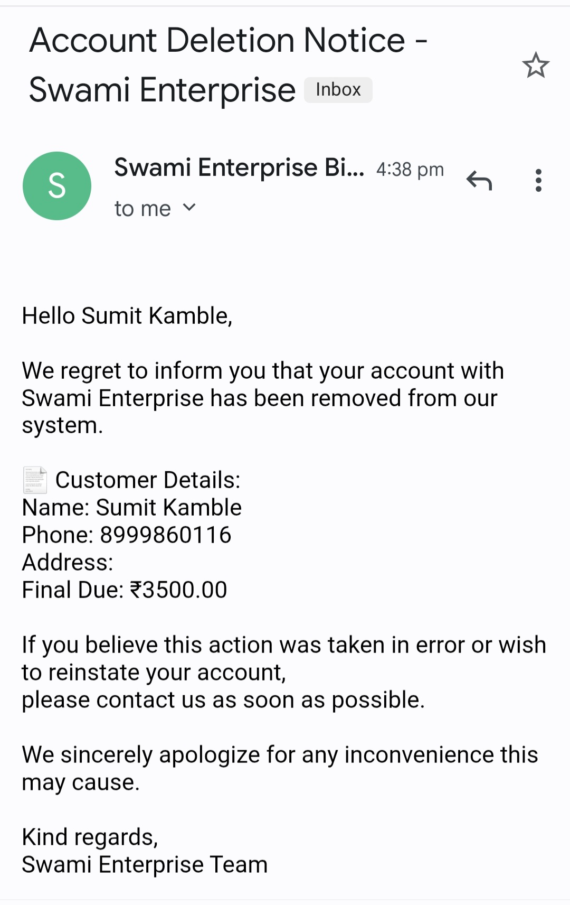

**📕 CUSTOMER DUE TRACKER SYSTEM**

 🐍
 🌐
 📊
 ⚖️

## 📝 PROJECT OVERVIEW
The **CUSTOMER DUE TRACKER SYSTEM** is a complete solution for businesses to manage customer payments 💰, track outstanding dues 📋, and automate reminders ⏰. It provides a secure 🔒 and user-friendly platform where administrators can manage customer accounts 👤, monitor payments 💳, and send automated notifications 📧. Customers can log in to view their dues, make partial or full payments 💸, and access their payment history 📜. The system combines a Flask-based backend ⚙️ with a Streamlit-powered frontend dashboard 📈, ensuring smooth interaction, real-time tracking 🕒, and insightful analytics 🔍. With built-in authentication, activity logging 🗂️, and scheduling features 📅, this system helps businesses streamline payment management and improve customer communication effectively.

## 🚀 CORE FEATURES 

**Customer Management** 👥  
- Add, update, and delete customer records ➕✏️❌  

**Due Tracking** 💵  
- Track outstanding payments and partial payments ⚖️

**Authentication** 🔑  
- Secure login for both admin and customers 🛡️  

**Email Notifications** 📧  
- Automated emails for payments, daily reminders, and account changes ✉️  

**Dashboard** 📊  
- Visual analytics of customer dues and payment status 📉📈 

**User Portal** 🖥️  
- Customers can view their dues and make payments 💳

**Activity Logging** 🗃️  
- Detailed logs of all system activities 📝  

**Storage** 💾  
- Customer data and logs stored in CSV files 📂  


# 🖥️ BACKEND
- RESTful API built with Flask ⚙️ — provides APIs for customer, due, and payment management  
- Handles authentication, business logic, background scheduling ⏱️, and logging 📝  
- Uses CSV files for data storage 💾  
- Manages email notifications using SMTP integration ✉️  

# 🌐 FRONTEND
- Built with Streamlit 📊 — interactive and intuitive dashboard  
- Allows admins to manage customers, view analytics, and send notifications 📈  
- Allows customers to log in, view dues, make payments 💳, and check history  
- Clean, responsive interface with real-time updates 🔄  

**🛠️ TECHNOLOGIES USED**

  - Python 3.x – Core language 🐍 
  - Flask – Backend REST API ⚙️  
  - Streamlit – Frontend dashboard 📊  
  - CSV Files – Data storage 💾 
  - SMTP – Email notifications ✉️
  - .env – Environment variables 📄
  - Schedule – Task scheduling ⏰


**📚 LIBRARIES USED**
 
  - Flask, Flask-CORS – API & cross-origin support 🌐
  - Streamlit – UI framework 📊
  - Pandas – CSV handling & analytics 🐼
  - Requests – API communication 🌍
  - Schedule – Background jobs ⏱️
  - python-dotenv – Env variable management 📄
  - smtplib, email.mime – Email handling ✉️
  - csv, logging, functools, datetime, os 🛠️– Standard Python utilities


**⚙️ How the Project Works**

1.  Backend (Flask) → Manages customers, dues, payments, emails, and logs 📂 (stored in CSV).
    It also runs background schedulers to send daily reminders ⏰ automatically.
    All business logic and activity tracking is centralized here.

2.  Frontend (Streamlit) → Admins manage records & analytics 📊; customers view/pay dues 💳.
    It connects to the backend APIs 🔄 and shows real-time data in an interactive dashboard.
    Provides a clean, user-friendly interface for both roles.

3.  Emails → Auto-sent for account creation, reminders, and receipts ✉️.
    This ensures both admins and customers are always updated on activities.
    Notifications improve communication 📢 and reduce missed payments ❌💰.


## FOLDER STRUCTURE :--
```
Customer_Due_Tracker_System/
├── backend/ ⚙️
│ ├── data/ 💾
│ │ ├── added_customers.csv
│ │ ├── customers.csv
│ │ ├── deleted_customers.csv
│ │ ├── dues.csv
│ │ ├── email_logs.csv
│ │ ├── logs.csv
│ │ ├── partial_customers.csv
│ │ ├── signin_logs.csv
│ │ ├── signin.csv
│ │ ├── updated_customers.csv
│ │ ├── user_account_deleted.csv
│ │ └── user_payment_updated.csv
│ ├── notifications/ ✉️ # Email notification services
│ │ ├── init.py
│ │ └── email_service.py
│ ├── init.py
│ ├── app.py ⚙️ # Flask backend server
│ ├── decorators.py 📝 # Logging decorators
│ ├── routes.py 🌐 # API endpoints
│ ├── scheduler.py ⏰ # Background tasks
│ └── services.py 🔧 # Business logic
├── frontend/ 📊
│ └── streamlit_app.py 🖥️ # Streamlit UI
├── .env 📄 # Environment variables
├── README.md 📘
├── requirements.txt 📦 # Python dependencies
└── run.bat ⚡ # Windows startup script
```

## ⚡ INSTALLATION STEPS

# Step 1
  **Install dependencies**
  
    - pip install -r requirements.txt

# Step 2
  **Create a .env file in the root directory**

    - EMAIL_ADDRESS = your_email@gmail.com ✉️
    - EMAIL_PASSWORD = your_app_password 🔑
    - shop_name = "Your Business Name" 🏪

# Step 3

  **To run the backend**

    - d: && cd Projects\Customer_Due_Tracker_System\backend && python app.py ⚙️
  
  **To run the frontend**

    - d: && cd Projects\Customer_Due_Tracker_System\frontend && streamlit run streamlit_app.py 📊

# Step 4: Run the run.bat file ⚡
  Double-click to start backend & frontend simultaneously 🔄
    **Run.bat**

    @echo off
    REM Run Customer Due Tracker (from anywhere)

    REM Set your project directory (fixed path)
    set "PROJECT_DIR=D:\Projects\Customer_Due_Tracker_System"

    REM Start backend (Flask API)
    start cmd /k "cd /d "%PROJECT_DIR%\backend" && python app.py"

    REM Start frontend (Streamlit)
    start cmd /k "cd /d "%PROJECT_DIR%\frontend" && streamlit run streamlit_app.py"

# Step 5
  **Admin login** 🤵

    Username : admin
    Password : 1234

  **Customer login** 👨‍💼

    Customers receive credentials via email when their account is created ✉️


## 🛡️ Admin Features
- Login with default credentials 🔑
- Add/Edit/Delete customers ➕✏️❌
- View all customer records 👁️
- Reset customer credentials 🔄
- Track payment history 💳
- View analytics dashboard 📊
- Send manual notifications ✉️

## 👨‍💼 Customer Features
- Login with credentials received via email ✉️
- View personal due amount 💰
- Make partial payments 💵
- Delete account 🗑️
- View payment history 📜

## 📧 Email Notifications
- New account creation 🆕
- Payment receipts 💳
- Due reminders ⏰
- Account deletion confirmation ❌
- Credential resets 🔑

## 📸 OUTPUT OF PROJECT
### Add Customer ➕


### Customer Credentials Management 🔑


### Delete Customer 🗑️


### Pay Your Due 💵


### Transaction History 📜


### Signin Pages 🔐


<div align="center">

### Account Created 🆕


### Account Deleted ❌


</div>

## 📌 Developer Info
Made with ❤️ by **ELITE CODERS** 👨‍💻
© 2025 All rights reserved.

